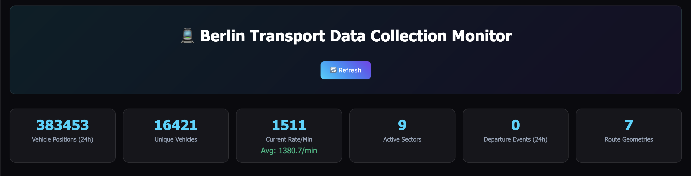
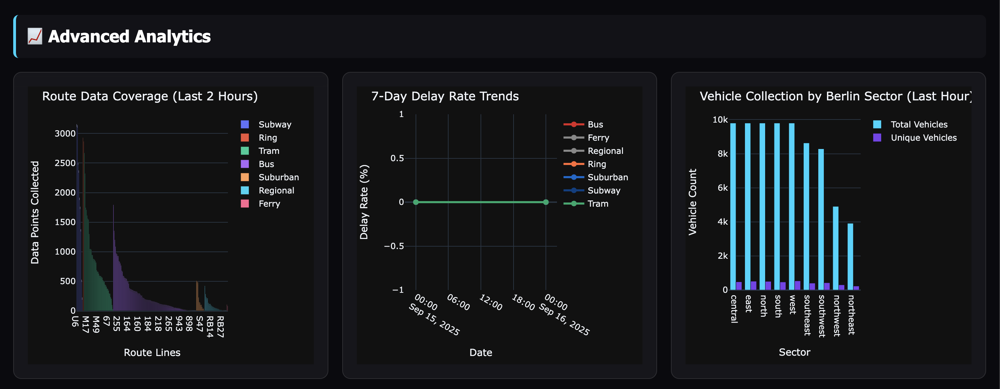
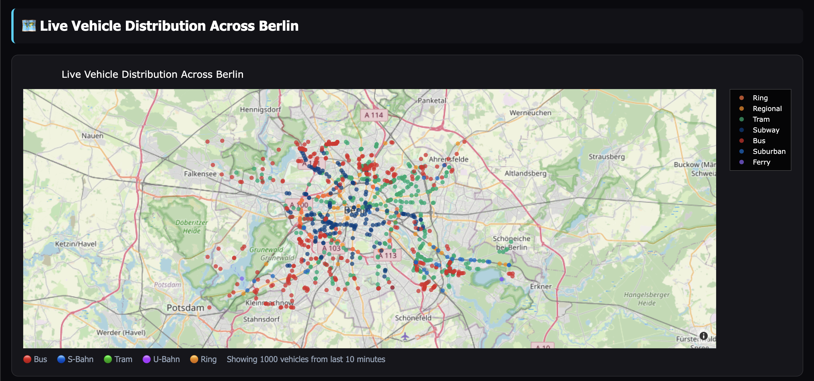
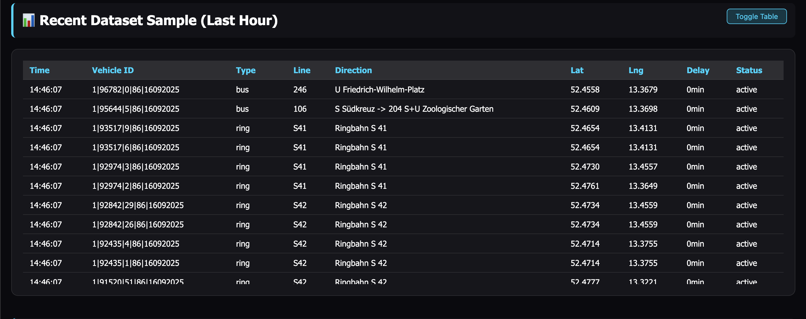

# Berlin Pulse - Real-time Transport Monitoring System



A comprehensive real-time data collection and monitoring system for Berlin's public transport network. Features advanced analytics, live tracking, interactive dashboards, and historical data visualization with enhanced transport type classifications including Ring lines.

## Tech Stack

- **Backend**: Python 3.11, FastAPI, AsyncIO
- **Database**: PostgreSQL 15, Redis  
- **Visualization**: Plotly, Pandas, Jinja2
- **Infrastructure**: Docker, Docker Compose
- **APIs**: BVG transport.rest API v6
- **Monitoring**: Real-time dashboards with advanced analytics

## Features

### Real-time Data Collection
- **Vehicle Position Tracking**: Live GPS coordinates for buses, trams, S-Bahn, U-Bahn, and Ring lines
- **Departure Monitoring**: Scheduled vs actual departure times with delay calculations
- **Route Geometry Mapping**: GeoJSON polylines and stop coordinate discovery
- **Enhanced Transport Classification**: Proper Ring line (S41/S42) and MetroTram support

### Advanced Analytics Dashboard


- **Route Coverage Analysis**: Data collection intensity by transport line
- **7-Day Reliability Trends**: Time-series delay analysis by transport type
- **Sector Efficiency Rankings**: Berlin district-wise performance with explained metrics
- **Real-time Collection Statistics**: Live data ingestion monitoring

### Interactive Visualizations


- **Live Berlin Transport Map**: Real-time vehicle positions with proper color coding
- **Enhanced Legend**: Ring lines (🟠), S-Bahn (🔵), U-Bahn (🟣), Tram (🟢), Bus (🔴)
- **Transport Performance Cards**: Individual breakdowns with delay metrics
- **Collapsible Dataset Table**: Recent vehicle data with toggle functionality

## Data Pipeline

### Architecture Overview
```
BVG API → Data Collectors → PostgreSQL → Enhanced Dashboard
   ↓           ↓              ↓            ↓
Radar API   Vehicle Tracker  Time-series   Advanced Analytics
Stops API   Departure Track  Storage       Live Visualizations
Trips API   Route Mapper     Validation    Performance Metrics
```

### Collection Components

1. **Vehicle Tracker** (Enhanced)
   - Collects real-time positions every 30 seconds
   - Improved transport type classification (Ring lines, MetroTram)
   - Better error handling and data validation

2. **Departure Monitor**  
   - Enhanced delay calculations (only considers actual delays)
   - Tracks 10 major transportation hubs
   - Improved performance metrics display

3. **Route Mapper** (Expanded)
   - **12 target routes** (increased from 3)
   - Covers S-Bahn, Ring, U-Bahn, Tram, and Bus lines
   - 4-hour warning threshold for periodic operations

### 🚀 Quick Start

1. **Start the data collection system:**
   ```bash
   docker-compose up -d
   ```

2. **Monitor collection progress:**
   - Open http://localhost:8080 for the monitoring dashboard
   - Check logs: `docker-compose logs -f data-collector`

3. **Verify data collection:**
   ```bash
   docker-compose exec postgres psql -U transport_user -d berlin_transport -c "SELECT COUNT(*) FROM vehicle_positions;"
   ```

### Enhanced Dashboard Features

The monitoring dashboard (http://localhost:8080) includes **new reorganized layout**:

**Advanced Analytics Section (Top)**
- Route Coverage Heat Map visualization
- 7-Day Delay Rate Trends by transport type  
- Real-time collection performance metrics

**Live Transport Visualization**  
- Interactive Berlin map with proper Ring line colors
- Transport Type Performance section (moved after map)
- Enhanced delay explanations and individual vehicle counts

**Data Management**

- Collapsible dataset table showing recent 25 vehicle records
- Data Quality Metrics with completeness indicators
- Sector Efficiency Rankings with calculation explanations (moved to end)

### 🔧 Configuration

Key environment variables in `.env`:
- `VEHICLE_COLLECTION_INTERVAL=30` - Vehicle position collection frequency (seconds)
- `DEPARTURE_COLLECTION_INTERVAL=60` - Departure events collection frequency (seconds)
- `DATA_RETENTION_DAYS=7` - Rolling data window size

### 📊 Data Schema

#### Vehicle Positions
- Real-time vehicle locations with transport type, route, delays
- Geographic coordinates for map visualization
- Status tracking (active, delayed, cancelled)

#### Departure Events
- Scheduled vs actual departure times
- Delay calculations and cancellation tracking
- Platform and trip information

#### Route Geometry
- GeoJSON polylines for accurate route visualization
- Stop coordinates and sequencing
- Direction-specific route paths

### 🔍 API Information

Uses BVG transport.rest API:
- **Base URL:** https://v6.bvg.transport.rest
- **No authentication required**
- **Rate limit:** 100 requests/minute
- **Endpoints used:** `/radar`, `/stops/{id}/departures`, `/trips/{id}`

### 📝 Logs

Collection logs are available in:
- Container logs: `docker-compose logs data-collector`
- File logs: `./logs/collectors.log`

### 🛠️ Development

To run components individually:

```bash
# Test vehicle tracker
cd data-collection
python vehicle_tracker.py

# Test departure tracker
python departure_tracker.py

# Test route mapper
python route_mapper.py
```

## Data Validation

Use the provided comprehensive validation commands:

```bash
# Run all validation queries  
docker compose exec postgres psql -U transport_user -d berlin_transport -f data_validation_commands.md

# Quick health check
docker compose exec postgres psql -U transport_user -d berlin_transport \
  -c "SELECT transport_type, COUNT(*) FROM vehicle_positions WHERE timestamp >= NOW() - INTERVAL '24 hours' GROUP BY transport_type;"

# Verify Ring line classification
docker compose exec postgres psql -U transport_user -d berlin_transport \
  -c "SELECT line_name, transport_type, COUNT(*) FROM vehicle_positions WHERE line_name IN ('S41', 'S42') GROUP BY line_name, transport_type;"
```

### Key Validation Features
- **Transport Type Distribution**: Verify suburban, subway, tram, bus, **ring** classifications
- **Data Freshness**: Check timestamps within last 15 minutes  
- **Geographic Bounds**: Confirm coordinates within Berlin area (52.3-52.7°N, 13.0-13.8°E)
- **Collection Health**: Monitor all collectors with appropriate warning thresholds


## Resources

### API Documentation
- **BVG transport.rest API**: [https://v6.bvg.transport.rest/](https://v6.bvg.transport.rest/)
- **API Documentation**: [https://github.com/public-transport/bvg-rest](https://github.com/public-transport/bvg-rest)
- **VBB GTFS Data**: [https://www.vbb.de/unsere-themen/vbbdigital/api-entwicklerinfos/](https://www.vbb.de/unsere-themen/vbbdigital/api-entwicklerinfos/)

### Technical References
- **FastAPI Documentation**: [https://fastapi.tiangolo.com/](https://fastapi.tiangolo.com/)
- **Plotly Python**: [https://plotly.com/python/](https://plotly.com/python/)
- **PostgreSQL Time-series**: [https://www.postgresql.org/docs/15/](https://www.postgresql.org/docs/15/)
- **Docker Compose**: [https://docs.docker.com/compose/](https://docs.docker.com/compose/)

### Berlin Transport Information
- **BVG Official**: [https://www.bvg.de/](https://www.bvg.de/)
- **VBB Network Map**: [https://www.vbb.de/fahrplan/](https://www.vbb.de/fahrplan/)
- **S-Bahn Berlin**: [https://sbahn.berlin/](https://sbahn.berlin/)
- **Berlin Transport Lines**: [https://en.wikipedia.org/wiki/Transport_in_Berlin](https://en.wikipedia.org/wiki/Transport_in_Berlin)


### Data Visualization
- **Plotly.js Reference**: [https://plotly.com/javascript/](https://plotly.com/javascript/)
- **MapBox Integration**: [https://plotly.com/python/mapbox-layers/](https://plotly.com/python/mapbox-layers/)
- **GeoJSON Specification**: [https://geojson.org/](https://geojson.org/)

## License

This project is licensed under the MIT License - see the [LICENSE](LICENSE) file for details.

### MIT License Summary
- **Free to use** for personal and commercial projects
- **Modify and distribute** without restrictions
- **No warranty** provided
- **Attribution required** (include license notice)
